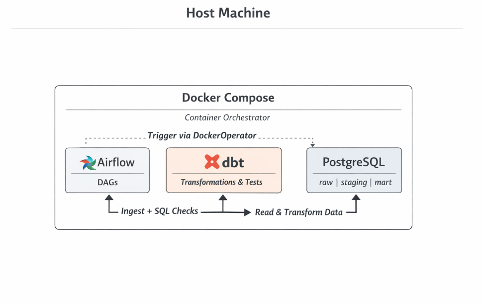
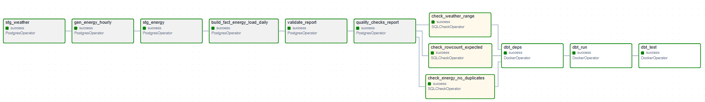

# ⚡ Airflow + dbt Mini Data Platform  
Weather-Driven Energy Demand Modeling

> Production-style containerized data pipeline orchestrating raw ingestion, transformation, validation, and analytics modeling using Airflow + dbt.

---

## 💎 Portfolio Impact (TL;DR)

- Designed a containerized, end-to-end data platform using Airflow + dbt
- Implemented layered warehouse architecture (raw → staging → mart) with idempotent rebuilds
- Built multi-layer data validation (infrastructure-level SQL checks + semantic dbt tests)
- Ensured reproducibility, deterministic outputs, and performance-aware schema design

---

## 🚀 Overview

**Goal**  
Design a reproducible, production-inspired data platform that transforms hourly weather data into validated, analytics-ready regional energy aggregates.

This project simulates a real-world data engineering setup where orchestration, transformation, storage, and validation are clearly separated.

---

## 🧱 Architecture Philosophy

This project intentionally separates concerns:

| Layer | Responsibility |
|-------|---------------|
| Airflow | Orchestration & task dependency management |
| Python | Raw ingestion & synthetic data generation |
| PostgreSQL | Data warehouse storage |
| dbt | Transformation logic & data tests |

Airflow controls execution order and system reliability.  
dbt controls transformation logic and semantic validation.

This mirrors modern production architectures where orchestration and transformation layers are decoupled.

---
## 🏗 System Architecture

<p align="center">
  
</p>

## 🧠 Why This Architecture?

This project is designed to reflect how production data platforms are structured:

### 1️⃣ Clear Separation of Responsibilities
- Airflow focuses on workflow orchestration
- dbt focuses on data modeling and validation
- PostgreSQL handles storage and indexing
- Python handles ingestion logic

Each component has a single responsibility.

---

### 2️⃣ Two-Layer Data Validation Strategy

Infrastructure-Level Validation (Airflow SQLCheckOperator):
- Temperature sanity range checks
- Duplicate detection
- Row-count drift monitoring
- Fail-fast behavior before transformation

Semantic-Level Validation (dbt tests):
- not_null
- unique
- unique_combination_of_columns
- dbt_utils expression checks

This mimics production systems where:
- Infrastructure ensures pipeline health
- dbt ensures analytical correctness

---

### 3️⃣ Idempotency & Determinism

- No hard deletes
- Re-runnable DAG without row duplication
- Stable analytical outputs across re-runs
- Deterministic dependency installation via `dbt deps`

The pipeline can be safely executed multiple times without data corruption.

---

## 🔁 Airflow DAG Structure

<p align="center">
  
</p>

This DAG enforces layered execution:
- Ingestion
- Infrastructure validation
- dbt transformation
- dbt semantic testing

---

## 🐳 End-to-End Flow

1. Validate processed weather CSV  
2. Load weather → `raw.weather_hourly`  
3. Generate synthetic energy → `raw.energy_load_hourly`  
4. Infrastructure sanity checks (fail-fast)  
5. dbt deps  
6. dbt run (staging + marts)  
7. dbt test (schema & business rule validation)

All steps are containerized and dependency-aware.

---

## 🏗 Warehouse Design

### Raw Layer
- Source traceability
- No transformations

### Staging Layer (dbt)
- Standardized column naming
- Type normalization
- View-based transformations

### Mart Layer (dbt)

Star-schema design:

- `dbt_staging.stg_weather_hourly`
- `dbt_staging.stg_energy_hourly`
- `dbt_mart.mart_weather_daily`
- `dbt_mart.mart_energy_weather_daily`

Grain:

- Weather: day  
- Energy: day × region  

---

## 🛡 Data Quality Strategy

Two-layer validation approach:

### Infrastructure Checks (Airflow)
- Temperature bounds validation
- Duplicate detection
- Row-count validation
- Fail-fast behavior

### Semantic Tests (dbt)
- not_null
- unique
- composite key validation
- expression-based business rules

---

## ⚡ Performance Engineering

- Composite index on `(region, ts)`
- No sequential scans on time-window joins
- Idempotent rebuilds
- Verified via `EXPLAIN`

Execution benchmark:
~0.7–1.4 ms for time-window join queries

---

## 📦 Tech Stack

- Airflow 2.9  
- dbt 1.8  
- PostgreSQL 15  
- Docker Compose  
- Python 3.12  

---

## 🧠 Business Insights

Derived from mart layer:

- Peak demand hour: 06:00  
- Weekend demand effect: -10.9% vs weekday  
- No cold-shock events observed  

---

## 📁 Project Structure

```
airflow-mini-etl/
├── dags/
├── etl/
├── weather_dbt/
│   ├── models/
│   ├── macros/
│   ├── seeds/
│   ├── packages.yml
│   └── dbt_project.yml
├── sql/
│   ├── raw/
│   ├── staging/
│   ├── mart/
│   ├── tests/
│   └── analysis/
├── data/
└── docker-compose.yml
```

---

## 🔁 Reproducibility Guarantees

Re-running the DAG:

- Does not change row counts
- Does not duplicate records
- Produces stable analytical outputs
- Ensures deterministic package resolution via dbt

---

## 🎯 Engineering Focus

This project emphasizes:

- Workflow orchestration best practices
- Separation of orchestration vs transformation
- Reproducible SQL analytics
- Star-schema modeling
- Multi-layer data validation
- Containerized deployment
- Production-style pipeline design